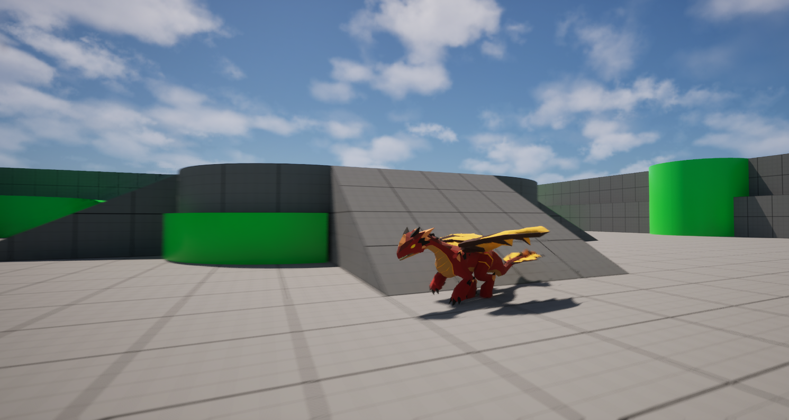
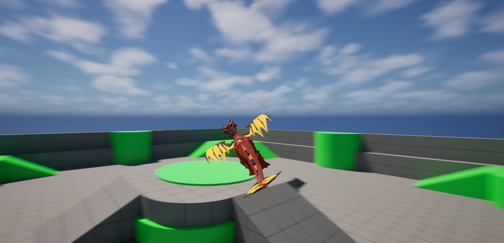
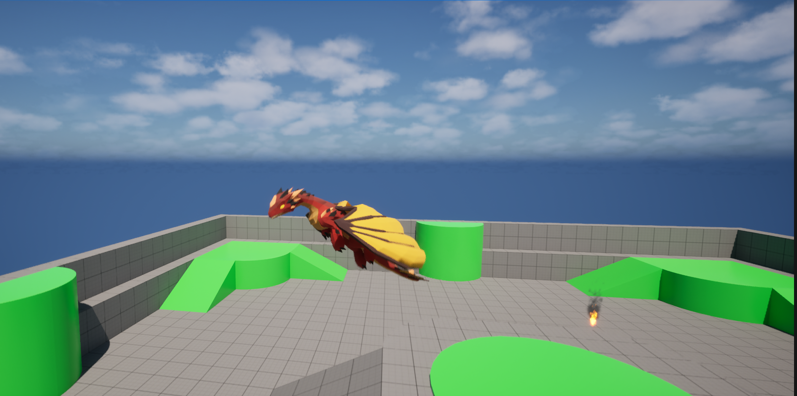

# Soar: A Dragon Locomotion Prototype

> A C++ Unreal Engine 5 gameplay prototype exploring expressive dragon locomotion inspired by the Spyro series.

The goal of this project is to design a highly responsive locomotion system featuring grounded movement, momentum-based flight, gliding, banking, and smooth animation transitions using modern Unreal Engine systems.

## 📖 Overview

Soar: A Dragon Locomotion is a 3D gameplay prototype inspired by the expressive movement and flight mechanics of the Spyro series. The project began as an exploration of how a responsive creature locomotion system could combine grounded movement with momentum-based aerial traversal. The concept of being able to fly at anytime inspired me to want to learn how to implement a satisfying flight system with my own creative liberties. The goal of the project prototype was to create a working demo that explored creature locomotion and movement programming and pyhsics in Unreal Engine. I also designed the system with future extensibility in mind, with the long-term goal of exploring how the locomotion architecture could evolve into a reusable Unreal Engine component or plugin.

## Contributions

### My Role: Gameplay Engineer

I designed and implemented the prototype's core locomotion and gameplay systems using C++ and Unreal Engine's Enhanced Input and Character Movement frameworks.

I developed 7 gameplay systems in Unreal Engine using C++:

- Locomotion State System
- Ground Movement
- Momentum-Based Flight
- Flight Diving 
- Camera Follow
- Movement Debugging
- Dynamic Lift System

## Features

- Ground locomotion
- Walking, running, charging, and jumping
- Momentum-based flight
- Gliding and diving 
- Banking and aerial turning
- Environmental lift
- Ground-to-flight transitions
- Animation Blueprint integration

---

## 🎮 Gameplay

In Soar: A Dragon Locomotion Prototype, the player uses WASD or Left Stick to move the player character in their desired direction. The prototype is designed as a movement sandbox where players can experiment with the dragon's mobility across ground and aerial environments. The player can charge [Right Shift/B], jump [Space/B], and enter flight [Enter/Right Trigger]. The prototype focuses on exploring how vector-based momentum can be used to create intuitive and responsive aerial movement.

### Controls

#### Ground Controls

| Action | Keyboard | Xbox |
|---|---|---|
| Move | WASD | Left Stick |
| Camera | Mouse | Right Stick | 
| Charge | Right Shift | X | 
| Jump | Space | A | 
| Take Off | Enter | Right Trigger | 

#### Flight Controls

| Action | Keyboard | Xbox |
|---|---|---|
| Pitch Up | W | Left Stick Down |
| Pitch Down | S | Left Stick Up |
| Roll Right | D | Left Stick Right |
| Roll Left | A | Left Stick Left |
| Camera | Mouse | Right Stick | 
| Dive | Right Shift | X | 
| Flap | Enter | Right Trigger | 

---

## 🛠️ Technical Implementation

### Ground & Flight Locomotion

The ground & flight locomotion was implemented using Unreal Engine's Character Movement framework systems to handle ground movement and locomotion states.

- Implemented a state-based locomotion system that manages transitions between Grounded, Taking Off, Flying, Gliding, Diving, and Landing states.
- Implemented walk, run, charging and jumping using Unreal Engine's Character Movement framework.
- Dynamically switched SetMovementMode() between MOVE_Flying and MOVE_Walking to transition between aerial and ground locomotion.

### Momentum-Based Flight

Momentum-based flight was implemented using C++ movement logic to preserve the dragon's existing horizontal momentum when transitioning from ground to aerial movement rather than resetting its velocity.

- Used FMath and velocity calculations to control acceleration, speed, and directional changes during flight.
- Preserved horizontal momentum by retrieving the character's velocity with GetVelocity() and storing the X/Y components in an FVector.
- Applied a small forward impulse during aerial transitions to help maintain and build momentum 
- Used FRotator to control the dragon's roll during directional turns.

### Dynamic Lift System

The dynamic lift system uses Unreal Engine's collision and overlap framework to detect when the dragon enters a designated lift volume and apply an upward force.

- Implemented a custom UBoxComponent-based volume to define the area affected by the lift.
- Used OnComponentBeginOverlap() and OnComponentEndOverlap() to detect when the dragon enters and exits the lift volume.
- Integrated the lift volume with the dragon's flight system to provide an environmental upward boost.
- Added a particle effect to visually communicate the location and presence of the lift volume.

---

## 🧩 Challenges & Solutions

### Challenge 1 — Ground/Flight Transition

**Problem:**  
During testing, the dragon could become stuck in the flight movement mode after contacting the ground, preventing the locomotion state from transitioning correctly to landing.

**Solution:**  
To resolve this problem, I used Unreal Engine's logging to identify the MovementMode of the player. Through Unreal's logging, I diagnosed that Unreal's CharacterMovementComponent state was stuck in flight mode as opposed to transitioning. After, diagnosising the issue, I implemented a line trace from the player capsule to detect how far the player is from the ground. If the line trace hits the ground, then the player transitions into ground mode. 

**Result:**  
After solving this issue, I managed to keep adjusting the line trace for better accuracy in detecting the ground. Resulting in seamless transitions, a polished gameplay experience and stronger foundation to build upon in future iterations. 

---

### Challenge 2 — Ground Velocity Perservation

**Problem:**  
During the development, I also encountered the challenge of preserving forward momentum from the 4 ground states (idle, walk, run, charge) and carrying it over into flight. As the player would only use a set speed, rather than initially using the speed before they transition into flight.

**Solution:**  
To solve this issue, I used Unreal Engine's GetCharacterMovement() function to access the Character Movement Component and determine the player's current movement velocity before transitioning into flight. I then set GetCharacterMovement()->MaxFlySpeed based on the current FlightSpeed and clamped the value to prevent excessive speeds. I also extracted and stored the character's horizontal velocity, which was then applied to the player character upon entering flight mode.

**Result:**  
As a result, the player character is now able to carry speed from their last state. Allowing for the player to comfortably make change gameplay states with intention and satisfaction. While also strengthening the current prototype. 

## 🚀 What I Learned

- During development of Soar: A Dragon Locomotion Prototype, I learned the importance of utilizing Unreal Engine's logging to identify issues quickly and iterate on intitial implementations. The use of Unreal's logging helped me become effective and coordinated in solving problems with Unreal Engine.
- I also learned how to meticulously plan and execute gameplay systems heavily relying on mathematics. With prior experiences with game projects, there was math involved, but not to the same level as this protoype. As momentum and physics are the key central point to my the gameplay mechanics. Through this, I understood process of integrating complex gameplay systems. 
- Lastly, I learned how to plan, build, iterate, and test new gameplay mechanics. This was my first Unreal Engine project where I worked on developing a complex gameplay mechanic. To compensate for the complex of the project, I needed to use the 4 phases to deliver a richly satisfying mechanic that can be continued to be re-iterated.

---

## 🔮 Future Improvements

- The next step I want to take with Soar: A Dragon Locomotion Prototype is to refine and and polish the flight mechanics. Essentially, I want to minimize the amount of bugs to enhance the overall gameplay experience. For example, when the player presses the takeoff button, they instantly lose forward momentum without flapping the dragon's wings. The goal with this fix is to ensure that the dragon can carry forward momentum, but loses speed (forward velocity drops to a minimum speed, not 0) when the player isn't engaging with the game's mechanics. Thus, resulting the dragon gliding downward to ground level. 
- Another improvement I'd like to make is explore and implement ways for the player to engage with the environment to create lift and generate more forward momentum. Employing the player to become an active participant while playing/testing the prototype.  
- Refactor the locomotion architecture into a dedicated movement component to improve modularity and explore Unreal Engine's lower-level movement systems.  

---

## 🎥 Gameplay / Demo

**Video Demo:** Will be displayed soon!

---

## 📸 Screenshots

### Dragon Charge

### Dragon Flight

### Jump Mid-Air

---
## Tech Stack
- Unreal Engine 5.6
- C++
- Enhanced Input
- Animation Blueprints
- Git LFS
---

## 🚧 Project Status

This prototype is actively being developed. Current work focuses on refining aerial momentum, environmental lift, animation transitions, and locomotion architecture.

## 📝 Documentation

This README was authored and is maintained by Ishmael Kwayisi to
document the project's development, technical implementation, and
solo contributions.

## 🎨 Credits & Attribution

- **Elemental Dragon** — MalberS Animations via Fab
  - Used for dragon character models and animations.
  - Licensed under the **Fab Standard License**.

- **Stylized VFX Collection : Fire** — Polyart Studio via Fab
  - Used for fire models, vfx and animations.
  - Licensed under the **Fab Standard License**.

## License

The original source code developed for this project is licensed under the MIT License.

This license applies only to original work contained within this repository. Unreal Engine, third-party assets, animations, models, and other externally provided content are not covered by this license and remain subject to their respective licenses and terms of use.

Third-Party Content

This project uses Unreal Engine and third-party assets for development and demonstration purposes. Third-party content remains the property of its respective owners and is subject to the licenses under which it was provided.

The MIT License does not grant permission to use, reproduce, modify, or redistribute third-party content included with the project.